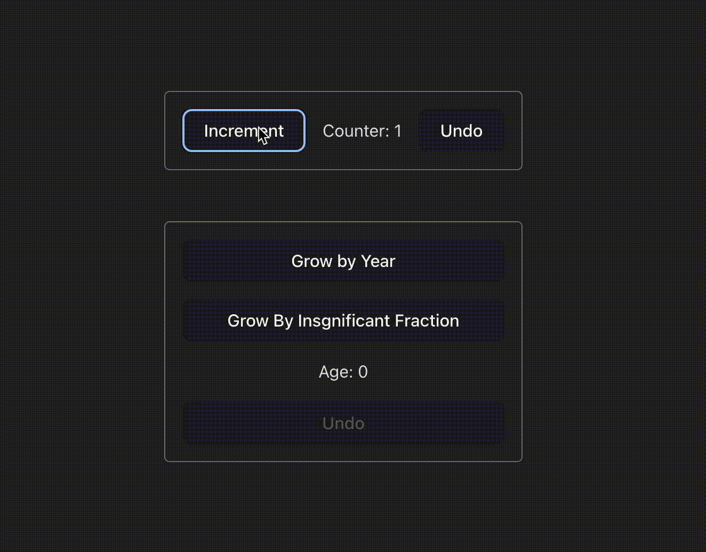

Add `undo` functionality to your existing redux slice.




## How to Use

1. Wrap your redux slice in a `withUndo`.
```js
import { configureStore } from "@reduxjs/toolkit";
import age, { growTinyFraction } from "./slices/age";
import counter from "./slices/counter";
import { withUndo } from "./undo";

export const store = configureStore({
  reducer: {
    ...withUndo({ counter }),
    ...withUndo({ age }, { ignore: { growTinyFraction } }),
  },
});
```

2. Call `undoSlice` wherever. You can also use `$HAS_HISTORY` to check if undo is possible.
```js
import { useDispatch, useSelector } from "react-redux";
import { growOneYearOlder, growTinyFraction } from "../redux/slices/age";
import { undoSlice } from "../redux/undo";

export function AgeComponent() {
  const { value, $HAS_HISTORY } = useSelector((state) => state.age);
  const dispatch = useDispatch();

  return (
    <div>
      <button onClick={() => dispatch(growOneYearOlder())}>Grow by Year</button>
      <button onClick={() => dispatch(growTinyFraction())}>Grow By Insgnificant Fraction</button>
      <span>Age: {value}</span>
      <button onClick={() => dispatch(undoSlice("age"))} disabled={!$HAS_HISTORY}>Undo</button>
    </div>
  );
}
```